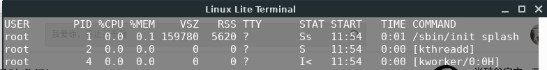

# Linux

## 目录结构

| 目录            | 含义                                                         |
| --------------- | ------------------------------------------------------------ |
| **/bin**        | bin是Binary的缩写, 这个目录存放着最经常使用的命令。          |
| **/boot**       | 这里存放的是启动Linux时使用的一些核心文件，包括一些连接文件以及镜像文件。 |
| **/dev**        | dev是Device(设备)的缩写, 该目录下存放的是Linux的外部设备，在Linux中访问设备的方式和访问文件的方式是相同的。 |
| **/etc**        | 这个目录用来存放所有的系统管理所需要的配置文件和子目录。     |
| **/home**       | 用户的主目录，在Linux中，每个用户都有一个自己的目录，一般该目录名是以用户的账号命名的 |
| **/lib**        | 这个目录里存放着系统最基本的动态连接共享库，其作用类似于Windows里的DLL文件。几乎所有的应用程序都需要用到这些共享库。 |
| **/lost+found** | 这个目录一般情况下是空的，当系统非法关机后，这里就存放了一些文件。 |
| **/media**      | linux系统会自动识别一些设备，例如U盘、光驱等等，当识别后，linux会把识别的设备挂载到这个目录下。 |
| **/mnt**        | 系统提供该目录是为了让用户临时挂载别的文件系统的，我们可以将光驱挂载在/mnt/上，然后进入该目录就可以查看光驱里的内容了 |
| **/opt**        | 这是给主机额外安装软件所摆放的目录。比如你安装一个ORACLE数据库则就可以放到这个目录下。默认是空的。 |
| **/proc**       | 这个目录是一个虚拟的目录，它是系统内存的映射，可以通过直接访问这个目录来获取系统信息。这个目录的内容不在硬盘上而是在内存里，可以直接修改里面的某些文件 |
| **/root**       | 该目录为系统管理员，也称作超级权限者的用户主目录。           |
| **/sbin**       | s就是Super User的意思，这里存放的是系统管理员使用的系统管理程序 |
| **/selinux**    | 这个目录是Redhat/CentOS所特有的目录，Selinux是一个安全机制，类似于windows的防火墙，但是这套机制比较复杂，这个目录就是存放selinux相关的文件的。 |
| **/srv**        | 该目录存放一些服务启动之后需要提取的数据。                   |
| **/sys**        | 这是linux2.6内核的一个很大的变化。该目录下安装了2.6内核中新出现的一个文件系统 sysfs 。 sysfs文件系统集成了下面3种文件系统的信息：针对进程信息的proc文件系统、针对设备的devfs文件系统以及针对伪终端的devpts文件系统。 该文件系统是内核设备树的一个直观反映。当一个内核对象被创建的时候，对应的文件和目录也在内核对象子系统中被创建。 |
| **/tmp**        | 这个目录是用来存放一些临时文件的。                           |
| **/usr**        | 这是一个非常重要的目录，用户的很多应用程序和文件都放在这个目录下，类似于windows下的program files目录。 |
| **/usr/bin**    | 系统用户使用的应用程序                                       |
| **/usr/sbin**   | 超级用户使用的比较高级的管理程序和系统守护程序。             |
| **/usr/src**    | 内核源代码默认的放置目录。                                   |
| **/var**        | 这个目录中存放着在不断扩充着的东西，我们习惯将那些经常被修改的目录放在这个目录下。包括各种日志文件。 |
| **/run**        | 是一个临时文件系统，存储系统启动以来的信息。当系统重启时，这个目录下的文件应该被删掉或清除。如果你的系统上有 /var/run 目录，应该让它指向 run。 |

## VI/VIM

## 常用命令

### 关机重启

| 命令            | 含义                                                   |
| --------------- | ------------------------------------------------------ |
| shutdown -h now | 立即关机                                               |
| shutdown -h  1  | 一分钟后关机                                           |
| shutdown -r now | 立即重启                                               |
| halt            | 直接使用等效于关机                                     |
| reboot          | 重启                                                   |
| syn             | 同步内存数据到磁盘，可在关机或重启前使用，防止数据丢失 |
| logout          | 退出当前登录用户                                       |

### 用户管理

​	linux中的用户至少属于一个组

用户配置文件（用户信息）:	**/etc/passwd**

> 用户名：口令：用户标识号：组标识号：注释性描述：主目录：登录shell
>
> `lov:x:1000:1000:lov,,,:/home/lov:/bin/bash`

组配置文件（组信息）:	**/etc/group**

> 组名：口令：组标识号：组内用户列表
>
> `lov:x:1000:`

口令配置文件（密码和登录信息，已加密）:	**/etc/shadow**

> 登录名：加密口令：最后一次修改时间：最小时间间隔：最大时间间隔：警告时间：不活动时间：失效时间：标志
>
> `mysql:!:18004:0:99999:7:::`

| 命令                     | 含义                                                         |
| ------------------------ | :----------------------------------------------------------- |
| useradd 用户名           | 创建用户。自动创建一个同名的用户组， 该用户归属于改组。在/home会创建同名目录 |
| useradd -d 用户名        | 指定home目录                                                 |
| passwd 用户名            | 指定密码                                                     |
| userdel 用户名           | 删除用户，但保留home目录                                     |
| userdel -r 用户名        | 删除用户及相关目录                                           |
| id 用户名                | 查看用户信息                                                 |
| su 用户名                | 切换用户                                                     |
| whoami                   | 查看当前用户                                                 |
| groupadd 用户组          | 添加组                                                       |
| groupdel 用户组          | 删除组                                                       |
| useradd -g 用户组 用户名 | 添加用户时指定组                                             |

### 运行级别

​	系统的运行级别配置文件以实现版本不同而定

| 运行级别 | 含义                       |
| -------- | -------------------------- |
| 0        | 关机                       |
| 1        | 单用户（找回丢失密码）     |
| 2        | 多用户状态（没有网络服务） |
| 3        | 多用户状态（有网络服务）   |
| 4        | 系统未使用（保留给用户)    |
| 5        | 图形界面                   |
| 6        | 系统重启                   |

| 命令      | 含义                 |
| --------- | -------------------- |
| runlevel  | 查看当前系统运行级别 |
| init 级别 | 切换运行级别         |

### 帮助

| 命令               | 含义                        |
| ------------------ | --------------------------- |
| man 命令或配置文件 | 获取帮助信息                |
| help 命令          | 获取shell内置命令的帮助信息 |

### 文件目录

| 命令                        | 含义                                                         |
| --------------------------- | ------------------------------------------------------------ |
| pwd                         | 显示当前工作目录绝对路径                                     |
| cd -                        | 返回上一次访问的目录，并打印目录路径                         |
| mkdir -p 目录               | 创建多级目录                                                 |
| rmdir 目录                  | 只能删除空目录                                               |
| touch 文件                  | 仅创建文件，可以同事创建多个文件                             |
| cp -r 原目录 目标目录       | 拷贝目录时递归拷贝? 当有多个重复文件时，用\cp强制覆盖所以文件 |
| rm -rf 目录                 | 直接删除目录 -r : 递归删除  ,    -f : 强制删除（无提示信息） |
| mv arg1 arg2                | 移动文件与目录或重命名                                       |
| cat -n 文件 \| more         | 查看文件内容 -n : 看行号 \| : 管道，将前面命令的处理结果传递给后面的命令 more : 分页显示 |
| less 文件                   | less与more类似，但less是根据显示需要才加载相应内容           |
| ls > 文件名                 | 将ls内容重定向输出到指定文件 > :  覆盖指定文件之前内容写入 >> :  追加写入 |
| echo $PATH                  | 输出环境变量                                                 |
| head -n 5 文件名            | （显示文件开头部分内容） 查看文件前5行内容，默认为前10行  |
| tail -n 5 文件名            | 与head类似，tail显示尾部内容                                 |
| tail -f 文件名              | 实时监控指定文件，当文件内容更新，输出更新内容               |
| ln -s 原文件或目录 软链接名 | 给原文件创建一个软链接，类似windows中的快捷方式              |
| history 10                  | 显示最近10条历史命令 对于查询出的命令，会带有命令的编号 如： 341 ls -l  !341 : 执行指定编号的历史命令 |

### 时间日期

| 命令                          | 含义                                                     |
| ----------------------------- | -------------------------------------------------------- |
| date +%Y                      | 显示当前年份，默认显示完整日期 +%m : 月份 ， +%d : 天 |
| date "+%H:%M:%S"              | 格式显示时间                                             |
| date -s "2019-01-10 11:11:11" | 设置系统日期时间                                         |
| cal 2019                      | 显示2019年日历                                           |

### 搜索查找

| 命令                          | 含义                                                         |
| ----------------------------- | ------------------------------------------------------------ |
| find  目标目录 查找方式  文件 | 按照指定查找方式在目标目录下查找文件 -name :  按名字查找 -user : 按所属用户查找  -size :  按指定大小查找 文件名可以通配符 |
| find / -size +20M             | 在/目录下查找大于20m的文件 +20M  : 大于20m -20M : 小于20m 20M : 等于20m |
| updatedb                      | 创建或更新locate数据库                                       |
| locate 文件名                 | locate可以快速定位文件路径 locate利用事先建立的系统中所有文件名称以及路径的locate数据库实现快速定位。 |
| grep 选项 查找内容 目标文件   | 在目标文件中查找指定内容 -n : 显示匹配行及行号 -i : 忽略大小写 |

### 压缩解压

| 命令                           | 含义                                                         |
| ------------------------------ | ------------------------------------------------------------ |
| gzip / gunzip                  | gzip压缩会直接讲原来的文件变为压缩文件 gunzip解压缩      |
| zip -r 文件名.zip 压缩目录     | 压缩指定目录到指定的压缩文件中                               |
| unzip -d 指定目录 文件名.zip   | 解压指定文件到指定目录                                       |
| tar -zcvf a.tar.gz 1.txt 2.txt | 指定文件压缩到a.tar.gz -c : 产生.tar打包文件 -v : 显示详细信息 -f : 指定压缩后的文件名 -z : 打包同时压缩 -x : 解压文件 |
| tar -zxvf a.tar.gz             | 解压到当前目录                                               |
| tar -zxvf a.tar.gz -C 目录     | 解压到指定目录                                               |

### 组管理

| 命令                     | 含义                   |
| ------------------------ | ---------------------- |
| chown 用户名 文件名      | 修改文件的拥有者       |
| chgrp 组名 文件名        | 修改文件所属组         |
| usermod -g 组名 用户名   | 改变用户所在组         |
| usermod -d 目录名 用户名 | 改变用户登录的初始目录 |

### 权限

#### 文件信息

`drwxr-xr-x 2 lov lov 4096 4月  22 21:57  Desktop`

| 参数位     | 文件信息说明                                                 |
| ---------- | ------------------------------------------------------------ |
| 第 0 位    | 文件的类型： - 普通文件；d 目录；l 软链接 ； c 字符设备（键盘，鼠标）；b 块文件（硬盘） |
| 第 1-3 位  | 所有者拥有该文件的权限                                       |
| 第 4-6 位  | 所属组拥有该文件的权限                                       |
| 第 7-9 位  | 其他用户拥有该文件的权限                                     |
| 接着的数字 | 如果时文件信息，则表示硬链接数； 如果是目录则表示该目录的子目录个数 |
| lov lov    | 后面是文件所有者与所属组                                     |
| 4096       | 文件表示文件大小（byte）；目录则显示4096                     |

#### rwx权限

`r = 4，w = 2，x = 1`  该数值是通过二进制表示的值

| 参数 | 对于文件                                                     |
| ---- | ------------------------------------------------------------ |
| r    | 可以读取，查看                                               |
| w    | 可以修改，但不代表可以删除文件； 删除文件的前提是，对该文件所在目录有写权限 |
| x    | 可以被执行                                                   |

| 参数 | 对于目录                       |
| ---- | ------------------------------ |
| r    | 可以读取，ls查看目录内容       |
| w    | 可以修改，目录内创建、删除目录 |
| x    | 可以进入该目录                 |

#### 修改权限

`u：所有者  g：所有组  o：其他人 a：所有人`

| 命令                           | 含义                                                         |
| ------------------------------ | ------------------------------------------------------------ |
| chmod u=rwx,g=rx,o=x 文件/目录 | 分别给该文件的不同属性赋予不同权限                           |
| chmod o+w 文件/目录            | 给该文件的其他角色添加写权限                                 |
| chmod a-x 文件/目录            | 对所有用户移除对该文件的执行权限                             |
| chmod 751 文件/目录            | 相当于第一种，转换为数值                                     |
| chown newowner:newgroup file   | 改变用户的所有者和所有组 -R : 如果是目录，通过该参数递归修改 |

### 任务调度

​	crontab ：任务调度，进行定时任务设置	

| 属性/命令     | 含义                          |
| ------------- | ----------------------------- |
| -e            | 编辑crontab定时任务           |
| -l            | 查询crontab任务               |
| -r            | 删除当前用户所以的crontab任务 |
| select-editor | 选择默认编辑器                |

**简单任务实例**

1、设置个人任务调度  

`crontab -e`

2、输入内容，调度逻辑

`*/1 * * * * ls -l /etc/ > /tmp/to.txt`

**参数说明**

| 参数         | 含义                 | 范围                  |
| ------------ | -------------------- | --------------------- |
| 第一个 “ * ” | 一小时当中的第几分钟 | 0-59                  |
| 第二个 “ * ” | 一天当中的第几小时   | 0-23                  |
| 第三个 “ * ” | 一个月中的第几天     | 1-31                  |
| 第四个 “ * ” | 一年当中的第几个月   | 1-12                  |
| 第五个 “ * ” | 一周当中的星期几     | 0-7（0和7都是星期天） |

| 特殊符号 | 含义                                                         |
| -------- | ------------------------------------------------------------ |
| *        | 表示任何时间；比如第一个“*”表示每分钟都执行一次              |
| ,        | 表示不连续的时间；如`0 8,,12,16 * * *` ，代表每天的8点0分，12点0分，16点0分都执行一次 |
| -        | 代表连续的时间范围；如 `0 5 * * 1-6` ，代表在周一到周六的凌晨5点0分执行 |
| */n      | 代表每隔多久执行一次；如 `*/10 * * * *` ，代表每隔10分钟执行一次 |

### 分区

#### 基础

**MBR分区**

> 最多支持四个分区
>
> 系统只能安装在主分区
>
> 扩展分区要占一个主分区
>
> MBR最大支持2TB，但拥有最后的兼容性，因为是传统分区

**GPT分区**

> 支持无限个主分区（操作系统可能会限制，如windows最多128个分区）
>
> 最大支持18EB
>
> win7-64 以后支持GTP

#### 磁盘查询

| 命令                        | 含义                                                         |
| --------------------------- | ------------------------------------------------------------ |
| df -h                       | 查询系统整体磁盘使用情况                                     |
| du -h  目录                 | 查询指定目录的磁盘占用情况，默认为当前目录 -s : 指定目录占用大小汇总 -h : 带计量单位 -a : 含文件 --max-depth=1 : 子目录深度 -c : 列出明细的同时，增加汇总值 `du -ach --max-depth=1` |
| ls -l \| grep "^-" \| wc -l | 过滤出以‘-’开的行信息（文件信息），再计算结果的行数 即当前目录的文件数量 |
| tree                        | 树形图显示目录                                               |

### 网络配置

​	在虚拟机下将ip设置为静态，具体实现版本不同

### 进程管理

| 命令                                               | 含义                                                         |
| -------------------------------------------------- | ------------------------------------------------------------ |
| ps                                                 | 显示系统执行进程状态 -a : 显示当前终端的所以进程信息 -u : 以用户的格式显示经常信息  -x : 显示后台进程运行的参数 -e : 显示所以进程 -f  : 全格式 |
| kill [选项] 进程号                                 | 通过进程杀死进程 -9 : 强制进程立即停止                    |
| killall 进程名                                     | 通过进程名杀死进程，支持通配符                               |
| pstree [选项]                                      | 查看进程树形图 -p : 显示进程的PID -u : 显示进程的所属用户 |
| service 服务名 [start \| stop \| reload \| status] | 管理指定服务                                                 |
| netstat [选项]                                     | 查看系统网络情况 -an : 按一定顺序排序输出 -p : 显示哪个进程在调用 |

| 列      | 含义                                                         |
| ------- | ------------------------------------------------------------ |
| USER    | 该进程是由哪个用户产生的                                     |
| VSZ     | 该进程占用虚拟内存的大小，单位KB                             |
| RSS     | 该进程占用实际物理内存的大小，单位KB                         |
| TTY     | 该进程是在哪个终端中运行的。其中tty1-tty7代表本地控制台终端，tty1-tty6是本地的字符界面终端，tty7是图形终端。pts/0-255代表虚拟终端 |
| STAT    | 进程状态。常见的状态有：R：运行、S：睡眠、T：停止状态、s：包含子进程、+：位于后台 |
| START   | 该进程的启动时间                                             |
| TIME    | 该进程占用CPU的运算时间，注意不是系统时间                    |
| COMMAND | 产生此进程的命令名                                           |

#### 动态进程监控

| 命令 | 含义                                                         |
| ---- | ------------------------------------------------------------ |
| top  | 显示正在执行的进程，会自动更新信息 -d : 指定更新秒数 -i : 使top不显示任何闲置，僵死进程 -p : 通过指定监控进程id来监控某个进程状态 |

**交互操作**

| 命令 | 含义                    |
| ---- | ----------------------- |
| P    | 以CPU使用率排序，默认值 |
| M    | 以内存的使用率排序      |
| N    | 以PID排序               |
| q    | 退出top                 |
| u    | 选择监控用户            |
| k    | 杀死指定进程            |

# #

|       |                         |
| ----- | ----------------------- |
| cd    | change directory        |
| pwd   | print working directory |
| mkdir | make directory          |
| chown | change owner            |
|       |                         |
|       |                         |
|       |                         |
|       |                         |
|       |                         |
|       |                         |

